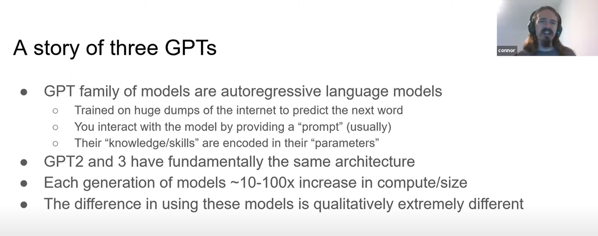

## Emergence and reasoning in large language models - Jason Wei (Google)
https://www.youtube.com/watch?v=0Z1ZwY2K2-M

- - -

# Large Language Models and the Future of AI with Connor Leahy, EleutherAI
https://www.youtube.com/watch?v=StLtMcsbQes

## Scaling law (quy luật mở rộng)

Đồ thị trên ở trục y là hiệu suất của mô hình (loss càng thấp càng tốt), ở trục x là một số tham số. Ở biểu đồ đầu tiên các đường màu xanh là hàm mất mát của mô hình trong quá trình huấn luyện. Bạn có thể thấy là khi chúng ta có nhiều sức mạnh tính toán hơn (more compute) và chúng ta huấn luyện những mô hình ngày càng lớn, chúng ta thấy quy luật lũy thừa khá nhất quán sẽ dự đoán hiệu suất cuối cùng mà chúng ta có thể thấy từ các mô hình này với một lượng tính toán cho trước. Quy luật tương tự cũng xuất hiện với số lượng tham số và kích thước của tập huấn luyện.

Những dự đoán này hoàn toàn dựa trên thực nghiệm. Đã có người lý giải về lý thuyết nhưng cuối cùng dựa vào kinh nghiệm thì chúng ta thấy __các mô hình lớn hơn và được cung cấp nhiều tính toán hơn chúng sẽ tiếp tục trở nên tốt hơn__.

Biểu đồ trên cho thấy, giả sử chúng ta có một lượng tính toán nhất định, cách tốt nhất để sử dụng lượng tính toán đó là gì? Bạn có thể sử dụng nó theo 1 trong 3 cách:
- huấn luyện mô hình trên nhiều dữ liệu hơn
- huấn luyện trên cùng một loại dữ liệu nhiều lần
- hoặc làm cho mô hình của mình lớn hơn

Đúng là các mô hình học sâu cần nhiều dữ liệu, nhưng từ thực nghiệm chúng tôi quan sát được rằng cách hiệu quả nhất để huấn luyện mô hình là khi bạn có quyền truy cập vào nhiều máy tính hơn, sẽ hiệu quả hơn khi đào tạo các mô hình lớn. Điều này có nghĩa là miễn các mô hình trở nên lớn hơn thì chúng thực sự trở nên tốt hơn.

Điều này thật điên rồi vì tôi vẫn nhớ khi tôi được dạy về mạng nơ ron, tôi vẫn nhớ mình được dạy rằng phải hết sức cẩn thận khi sử dụng mô hình nhỏ nhất có thể để nó không bị overfit (quá khớp với dữ liệu nến thiếu tính tổng quát hóa). Nhưng điều đó không đúng ở đây, nó có thể đúng với tập dữ liệu nhỏ và tác vụ khác nhưng, ở đây dường như mô hình càng lớn thì càng hoạt động tốt hơn.

Điều này thật đáng ngạc nhiên vì rất nhiều người tin rằng chúng ta cần những đột phá về thuật toán để đạt được những tiến bộ trong những tác vụ chuyên biệt của xử lý ngôn ngữ tự nhiên vì chúng ta đã đạt tới giới hạn với các phương pháp đang có. Nhưng quy luật mở rộng cho thấy rằng ít nhất theo kinh nghiệm, điều đó dường như không đúng. Tôi không nói rằng quy luật mở rộng không có giới hạn, có lẽ giới hạn của nó là Shannon entropy. 

Chúng ta không biết khi nào họ sẽ đạt tới giới hạn đó, và nó sẽ tới nhanh như thế nào, và __khi họ chạm tới Shannon entropy, điều đó có nghĩa là họ dự đoán mọi thứ một cách hoàn hảo nhất có thể__. Và chúng ta có một phương pháp hoàn hảo để biết mọi thứ cần biết. Cái chúng ta biết bây giờ chỉ là nếu có nhiều sức mạnh tính toán hơn, chúng ta sẽ dự đoán rằng các mô hình sẽ tiếp tục trở nên tốt hơn, không cần thêm insights gì mới, chỉ cần nhiều sức mạnh tính toán hơn. Điều đó hơi kỳ quặc, và nó đi ngược lại rất nhiều kinh nghiệm trực giác mà nhiều người trong lĩnh vực này có. Vì vậy tôi cảm thấy như đây là một hướng đi mới cho một loại mô hình mới. Ngay cả giới học thuật tôi cảm thấy hầu hết các học giả vẫn chưa hiểu rõ tại sao lại như vậy và lĩnh vực này có thể phát triển tới đâu trong tương lai.

Đường màu cam là hiệu suất của mô hình khi được fine-tine cho nhiệm vụ cần thực thi (giải toán chẳng hạn), đường màu xanh lá cây là một kỹ thuật sử dụng backprob để thuật toán hóa việc sinh ra prompts, và bạn có thể thấy là có một khoảng cách lớn giữa đường màu xanh lá cây và đường xanh da trời. Có nghĩa là nếu chúng ta chỉ đánh giá mô hình sử dụng những prompts tạo ra bởi con người, chúng ta không thực sự khai thác được hiệu suất cao nhất của mô hình. Mô hình có nhiều khả năng hơn thế, đơn giản là chúng ta chưa hỏi đúng câu hỏi vì thế chúng ta không đạt được hiệu suất mong muốn.

Lý giải điều này một cách nôm na là khi mô hình lớn học dữ liệu lớn nó học cả những thứ tốt nhất cũng như những lỗi sai từ dữ liệu, nó ghi nhớ hết cả những thứ tốt và chưa tốt trong những "mạch" khác nhau của bộ tham số. Thiết kế prompts là cách để "khuyến khích" mô hình sử dụng những "mạch" tốt.

Một cách vui vẻ để lý giải điều trên là "Mô hình ngôn ngữ lớn là một vật thể lạ rơi xuống trái đất mà chúng ta vẫn đang dùng đá đập vào để cố gắng khiến nòa làm ra những điều hữu ích" (hàm ý chưa biết sử dụng đúng cách). Chúng ta chưa tìm ra giao diện hợp lý nhất để khai thác chúng, chúng ta chưa hiểu hết khả năng của mô hình, và chúng ta đang điểm khởi đầu. Tôi thấy rằng mô hình lớn là một trong những ví dụ thực tế nhất của một công nghệ thế kỷ 21. Rất nhiều công nghệ chung quanh chúng ta chỉ là bản tốt hơn của công nghệ thế kỷ 20, nhưng với tôi mô hình lớn thực sự là một kỹ thuật nền tảng của thế kỷ 21. Một thứ gì đó rất mới, một thứ gì đó triệt để đến mức chúng ta cần một cách tiếp cận hoàn toàn mới để suy nghĩ về cách sử dụng chúng, kiểm soát chúng, và xây dựng các sản phẩm từ chúng.

- - -

# PaLM Pathways Language Model explained: 540 Billion parameters can explain jokes!?
https://www.youtube.com/watch?v=yi-A0kWXEO4

- - -

# Large Language Models: Will they keep getting bigger?
https://www.youtube.com/watch?v=1M2pEPZK_WA

The trend of building ever larger language models has dominated much research in NLP over the last few years. In this talk, I will discuss our recent efforts to (at least partially) answer two key questions in this area: Will we be able to keep scaling? And, how will we actually use the models, if we do? I will cover our recent efforts on learning new types of sparse mixtures of experts (MoEs) models. Unlike model-parallel algorithms for learning dense models, which are very difficult to further scale with existing hardware, __our sparse approaches have significantly reduced cross-node communication costs and could possibly provide the next big leap in performance__, although finding a version that scales well in practice remains an open challenge. 

I will also present our recent work on prompting language models that better controls for surface form variation, to improve performance of models that are so big we can only afford to do inference, with little to no task-specific fine tuning. Finally, time permitting, I will discuss work on new forms of supervision for language model training, including learning from the hypertext and multi-modal structure of web pages to provide new signals for both learning and prompting the model. Together, these methods present our best guesses for how to keep the scaling trend alive as we move forward to the next generation of NLP models. 

## Not just bigger zero-shot learner https://youtu.be/1M2pEPZK_WA?t=212
Sự khác biệt nằm ở sự sáng tạo trong việc sử dụng model cũng có những đột phá tựa như cách scale mô hình. 

Câu hỏi đặt ra:
- Liệu có tiếp tục scale LLM được nữa không?
- Làm cách nào để sử dụng được những mô hình lớn đó?
- Làm thế nào để kết hợp được với các dạng supervised khác?

Điểm đáng lưu ý là các mô hình lớn nhất hiện nay (1000 tỉ tham số) có lẽ chưa được huấn luyện đầy đủ. Bằng chứng là với các mô hình nhỏ hơn như PaLM và Chinchilla, việc tiếp tục huấn luyện với nhiều dữ liệu và sức mạnh tính toán lại cho kết quả tốt hơn.

Và cuối cùng bạn có một thứ gọi là mô hình thưa. Trong quá trình mở rộng mô hình, tới một mức nhất định, nó sẽ trở nên quá tốn kém để cho mọi đầu vào kích hoạt mọi tham số, bạn cần một số điều kiện để rẽ nhánh.

Để đỡ tính toán ta dùng mô hình experts. Mỗi bộ máy tính toán chạy expert khác nhau, sau đó truyền tokens tới expert tốt nhất để xử lý nó rồi truyền ngược trở lại. Như vậy sẽ nảy sinh communication costs và việc truyền thông tin hiệu quả là rất quan trọng. Bù lại sẽ giảm lượng tính toán đi đáng kể.

Với experts sẽ có 2 thách thức ở đây:
- Bạn muốn experts chuyên môn hóa
- Bạn muốn experts có sự cân bằng khi huấn luyện, nếu dữ liệu nào cũng được chuyển tới để huấn luyện các experts thì cuối cùng chúng sẽ trông giống nhau. Nhưng nếu một số experts được huấn luyện nhiều, số khác lại bị bỏ đói thì experts đó sẽ không được sử dụng nhiều và nhìn tổng quan thì mô hình sẽ bị thu nhỏ lại.

Google có một bước đột phá trong hướng này với bài báo về G-shard. Thuật toán routing: học một hàm, với mỗi trạng thái ẩn, experts nào nó nên map tới ... G-shard hoạt động tốt nhưng lại không được sử dụng rộng rãi, lý do là vì nó rất cầu kỳ trong việc bạn phải thay đổi loss function, phải giữ một sự cân bằng, và phải thay đổi rất nhiều thứ nữa.

Vì thế khi chúng tôi bắt đầu nghiên cứu về hướng này, một trong những động lực là chúng tôi muốn đạt được kết quả tương tự nhưng mà làm cho mọi thứ trở nên đơn giản hơn, làm cho sự cân bằng trở nên dễ hiểu hơn, và hy vọng models có thể scale tốt hơn. Mặc dù chúng tôi vẫn chưa đạt tới mức đó, nhưng tôi cũng sẽ nói về nó một chút.

Ý tưởng chính ở đây là thay thế trainable balancing với algorithmic balancing.

https://huggingface.co/bigscience/bloom

