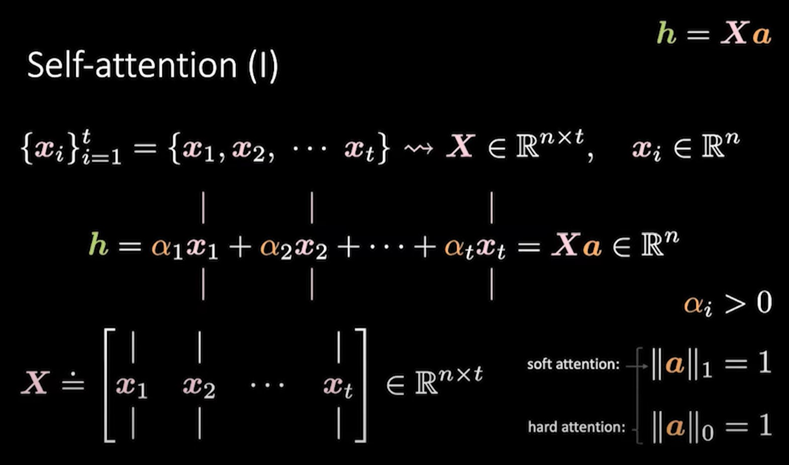
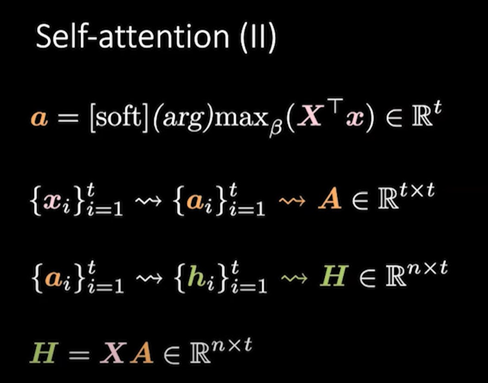
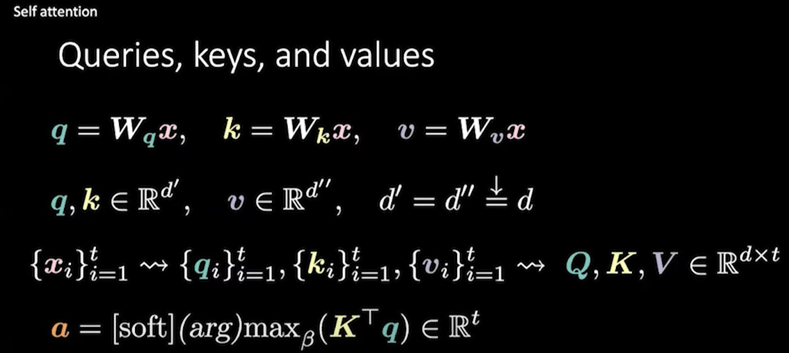
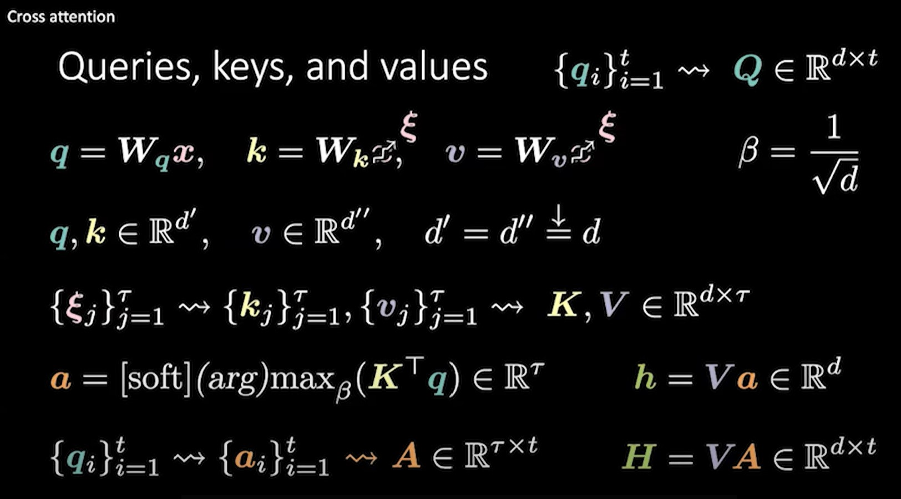

# Attn self/cross, hard/soft https://youtu.be/fEVyfT-gLqQ?t=284

Attn works on set of elements. Cả CNN và RNN operate on lattices, a sort of grid in 1, 2, 3 ... dims. 

## Self-attn https://youtu.be/fEVyfT-gLqQ?t=735

 

NN đơn giản là rotation, squashing, rotation, squashing, rotation, squashing, rotation ...
Dense / Linear layer là rotation, non-linear là squashing

Ở đây ta có phép nhân ma trận `h = X a`, trong trường hợp này ta sẽ không gọi nó là rotation bởi vì cái được rotate ở trường hợp này là ma trận A doesn't make sense. Trong rotation, squashing, rotation, squashing ... weights là người rotate. Tức là weights có khả năng học của NN là người rotate input vector x. Trong trường hợp này stack of vector x được nhân với ma trận A nên say x rotate A doesn't make sense.

h là hidden state, X là tập vectors đầu vào, a là coefficients (scales). Với soft-attn, thì các scales này có tổng bằng 1 (hàm phân phối xác suất). Với hard-attn chỉ có 1 aplpha bằng có giá trị = 1, còn lại là 0 (one-hot). 

## Cross-attn https://youtu.be/fEVyfT-gLqQ?t=2408

...