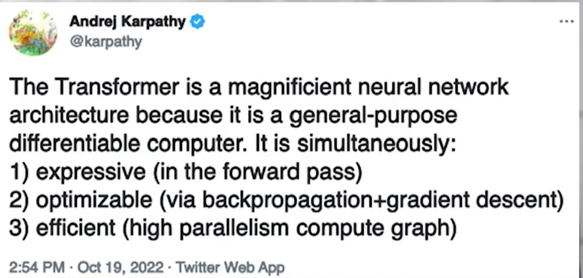

https://www.youtube.com/watch?v=9uw3F6rndnA

Looking back what is the most beautiful or surprising idea in DL or AI in general that you've come across you've seen this field explode and grow in interesting ways?

The most probably is the transformer architecture. Basically NNs have a lot of architectures that were trendy have come and gone for different sensory modalities (phương thức cảm nhận) như vision, audio, text. Bạn sẽ xử lý chúng bằng những loại NNs khác nhau. Và gần đây chúng ta thấy có sự hội tụ hướng tới một kiến trúc TFM. Bạn có thể cho nó video, image, text ... Nó giống như một máy tính đa năng, có thể đào tạo được, và rất hiệu quả để chạy trên phần cứng hiện đại.

Bài báo về TFM ra mắt vào 2016, attention is all you need, tôi không chắc tác giả có nhận thức được tác động của nó không, nhưng tôi nghĩ họ đã biết về một số động lực và quyết định thiết kế đằng sau tfm và họ đã chọn không, tôi nghĩ mở rộng nó theo cách đó trong bài báo. Vì vậy tôi nghĩ chọ có một ý tưởng rằng có nhiều thứ hơn là dịch máy. Nó giống như một máy tính hiệu quả có thể tối ưu hóa nhờ đạo hàm tự động. Có thể họ đã không nhìn xa đến vậy nhưng tôi nghĩ điều đó thực sự thú vị.

TFM là một kiến trúc NN vĩ đại vì nó là một máy tính đa năng có thể đạo hàm được. Nó: 1/ expressive (in the forward pass) 2/ tối ưu hóa được (via backprob + gradient descent) 3/ hiệu quả (high parallelism compute graph)
