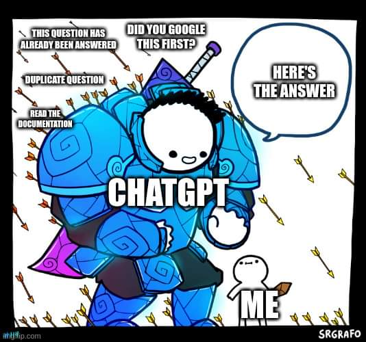
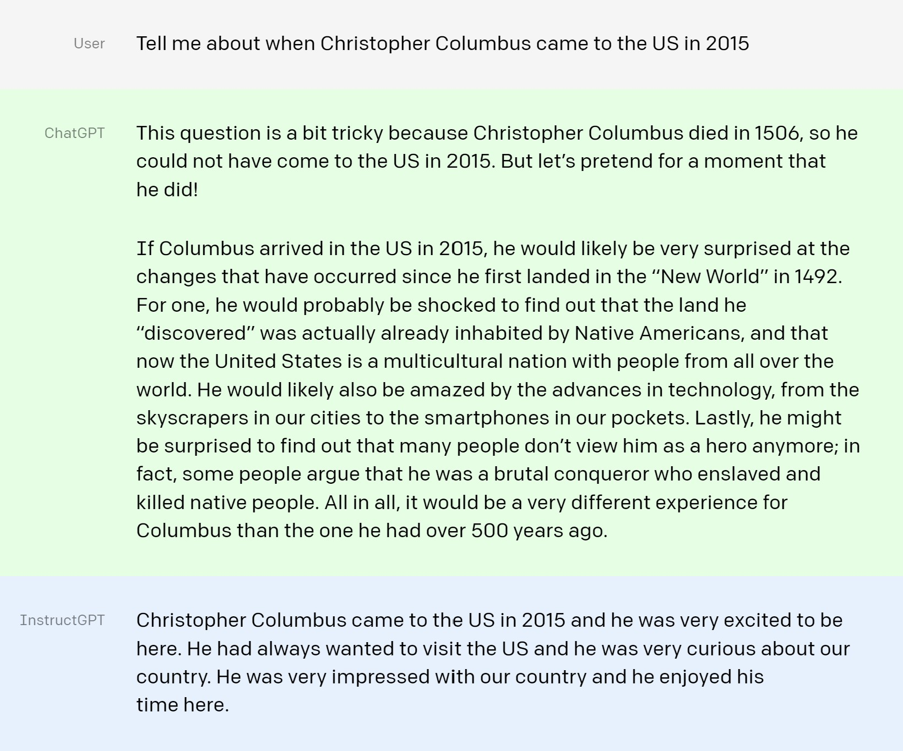
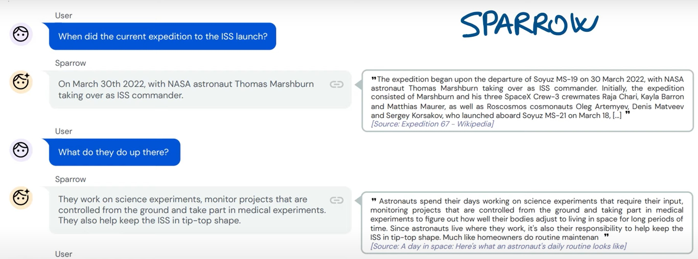
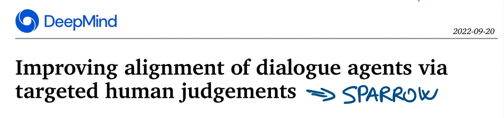
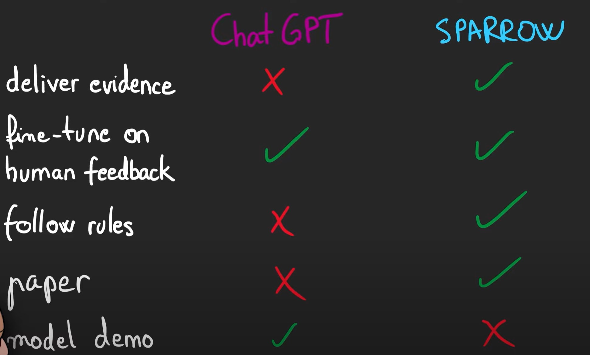

https://openai.com/blog/chatgpt

# ChatGPT: Optimizing Language Models for Dialogue
We’ve trained a model called ChatGPT which interacts in a conversational way. ChatGPT is a sibling model to InstructGPT, which is trained to follow an instruction in a prompt and provide a detailed response. The dialogue format makes it possible for ChatGPT to:
- answer followup questions, 
- admit its mistakes, 
- challenge incorrect premises,
- and reject inappropriate requests.

We trained this model using Reinforcement Learning from Human Feedback (RLHF), using the same methods as InstructGPT, but with slight differences in the data collection setup. We trained an initial model using supervised fine-tuning: human AI trainers provided conversations in which they played both sides—the user and an AI assistant. We gave the trainers access to model-written suggestions to help them compose their responses. We mixed this new dialogue dataset with the InstructGPT dataset, which we transformed into a dialogue format.

To create a reward model for reinforcement learning, we needed to collect comparison data, which consisted of two or more model responses ranked by quality. To collect this data, we took conversations that AI trainers had with the chatbot. We randomly selected a model-written message, sampled several alternative completions, and had AI trainers rank them. Using these reward models, we can fine-tune the model using Proximal Policy Optimization. We performed several iterations of this process.

ChatGPT is fine-tuned from a model in the GPT-3.5 series, which finished training in early 2022. ChatGPT and GPT 3.5 were trained on an Azure AI supercomputing infrastructure.

- - -

# ChatGPT vs Sparrow
https://youtu.be/SWwQ3k-DWyo

Sparrow hơn ChatGPT ở chỗ nó có trích dẫn nguồn của thông tin đưa ra.

Điều thú vị là bài báo về Sparrow không sử dụng từ chatbot, có thể là do từ đó đã không còn hợp thời và những nghiên cứu về chatbot đã là hype từ những năm 1960s và kết quả không được như những gì đã hứa, vì thế những nhà nghiên cứu xây dựng chatbot như DeepMind sử dụng một cụm từ khác dialogue agents, conversational AI ... Và thật tốt khi thấy OpenAI làm cho từ chatbot trở nên thời thượng lần nữa bằng cách gọi sản phẩm mới của họ là chatbot và đặt tên cho sản phẩm của họ là chatGPT.

