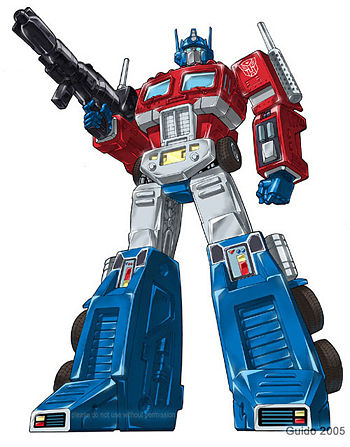

# Transformer implementation
- 10714 https://www.youtube.com/watch?v=OzFmKdAHJn0
- 11785 https://www.youtube.com/watch?v=X2nUH6fXfbc

- - -

# Transformer
10714 https://www.youtube.com/watch?v=IFKRf-BAqZo&t=1479s
- 2 cách tiếp cận để mô hình hóa chuỗi thời gian (time series)
- tự chú ý (self-attn) và Transformers
- transformers ứng dụng khác ngoài chuỗi thời gian

## 2 cách tiếp cận time series: lattent state approach


Ta có thể mô hình hóa bài toán mô hình hóa chuỗi thời gian bằng cách dự đoán `y_1:T = f_theta(x_1:T)` với y_t chỉ phụ thuộc vào x_1:t. 
f_theta có thể là bất cứ hàm nào miễn là nó giúp chúng ta dự đoán output từ input. Có nhiều cách để làm được điều đó, có thể không dùng tới biểu diễn latent state của RNNs.

__bản chất của RNN là "latten state" approach__ chúng lấy chuỗi đầu vào tới thời điểm x_t chẳng hạn rồi tổng kết / nhúng toàn bộ chuỗi đó vào một latent state h_t. Và trạng thái h_t đó summarize all information chúng ta quan sát được cho tới thời điểm t đó. RNN sẽ biểu diễn toàn bộ chuỗi thời gian (tới thời điểm t) bằng một latent (không quan sát được trực tiếp) state h.
- pros: RNN có thể capture infinite history, và có compact representation
- cons: compute path quá dài từ time bắt đầu cho tới current => vanishing / exploding gradients, hard to learn

__Điều này khiến latent state aproarch works in theory nhưng trong thực tế sẽ có vấn đề__

## 2 cách tiếp cận time series: direct prediction approach

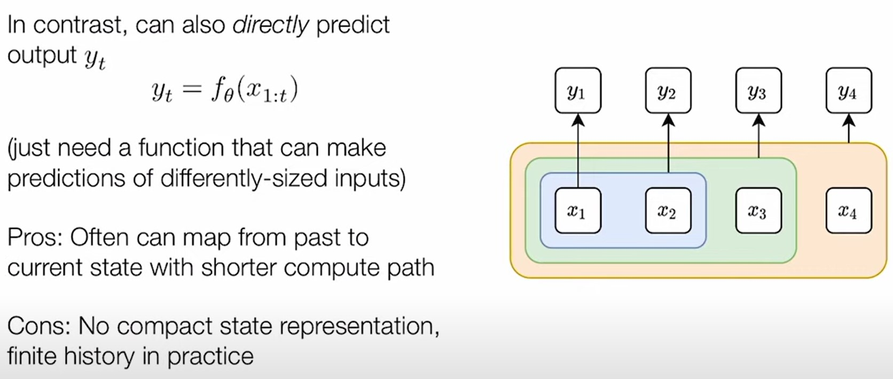

Cách tiếp cận này có vẻ dễ dàng hơn vì bạn chỉ cần chuỗi đầu vào để dự đoán đầu ra (no hidden states). Và compute path là đồng đều giữa các tokens trong sequence (trước sau đều như nhau). Trong thực tế, thường cách này sẽ dẫn đến một kiến trúc hiệu quả hơn là thực sự các thông tin thời gian.

Ngược lại điểm yếu của cách tiếp cận này là nó không có biểu diễn compact state cho chuỗi, nghĩa là với direct predict bạn sẽ bị giới hạn bởi độ dài chuỗi mà mô hình có thể handle, còn trong RNN không có giới hạn này vì compact state luôn đại diện cho toàn chuỗi từ thời điểm bắt đầu cho tới nay.

Tôi cho rằng __đó là khác biệt quan trọng nhất giữa RNN và Transformer trong dự đoán chuỗi thời gian__ 


https://youtu.be/IFKRf-BAqZo?t=678
Trước khi tôi giới thiệu transformer như là 1 cách dự đoán trực tiếp. Tôi muốn nhấn mạnh rằng có một phương pháp dự đón chuỗi thời gian trực tiếp cổ điển là dùng CNN.

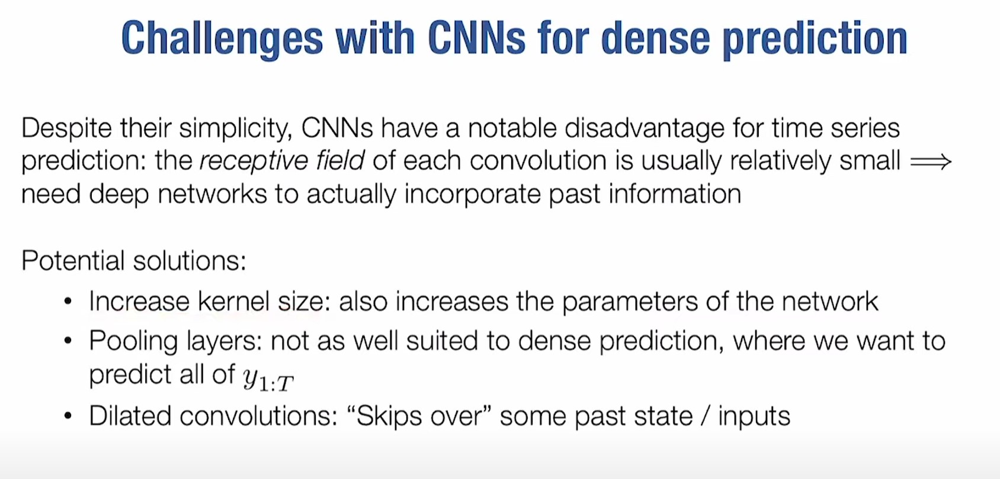
...

## Self-attn and tfm
__Ra đời 2017, và trở thành kiến trúc thống trị học sâu__ (5 năm tuổi). Chúng ta sẽ nói về tfm áp dụng trong chuỗi thời gian nhưng phải nói rằng chúng ta đang sống trong thời đại của tfm. Tức là những kiến trúc tốt nhất trong các lĩnh vựa tend to be tfm.

> Attn trong DL về cơ bản có ý nghĩa là bất cứ cơ chế nào trong đó các thành phần hoặc trạng thái riêng rẻ trong mạng được weighted và sau đó kết hợp với nhau. Nó có thể là một định nghĩa rộng nhưng tôi nghĩ nó bao trùm. Và nó là một định nghĩa tốt nó  bao gồm phần lớn những gì chúng ta muốn nói khi nói về attn in DL.

Thực tế attn trong DL ban đầu được đề xuất theo một cách khác, sử dụng một dạng kiến trúc khác, hơn là self-attn đang được sử dụng bây giờ, và nó được giới thiệu trong ngữ cảnh của RNN.

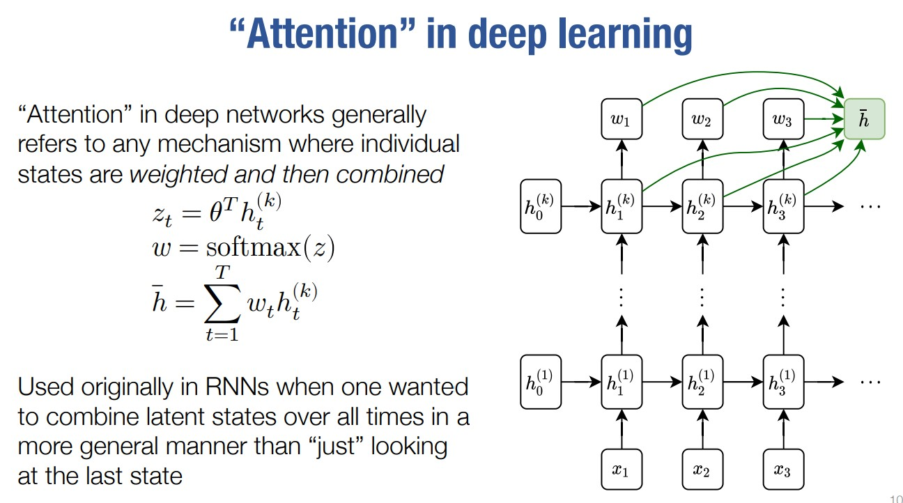

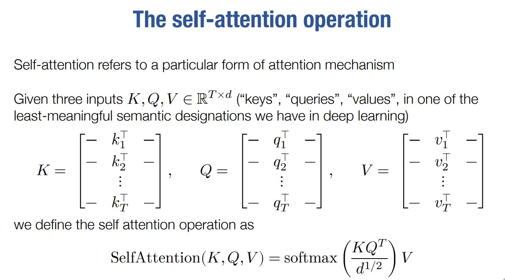

## Thuộc tính của self-attn https://youtu.be/IFKRf-BAqZo?t=2340

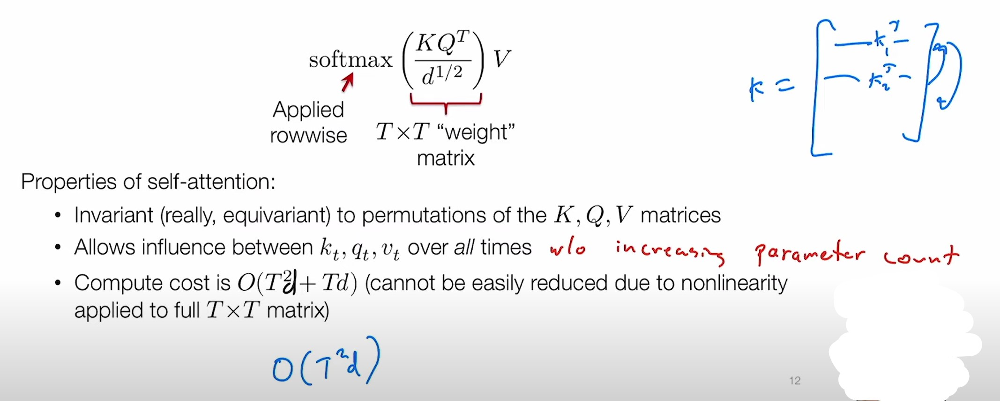

Thuộc tính thứ 2, sự ảnh hương lẫn nhau giữa k, q, v qua thời gian mà không cần tăng số lượng tham số là một thuộc tính hay cho dữ liệu chuỗi thời gian. So sánh với temporal CNN, thì để có độ ảnh hưởng qua thời gian lớn hơn bạn phải tăng số layer lên. Trong khi đó self-attn trộn toàn bộ chuỗi với nhau bất kể độ dài của chuỗi, nó cũng cung cấp loại trộn một lớp của toàn bộ chuỗi mà không cần bổ xung thêm bất cứ tham số nào.

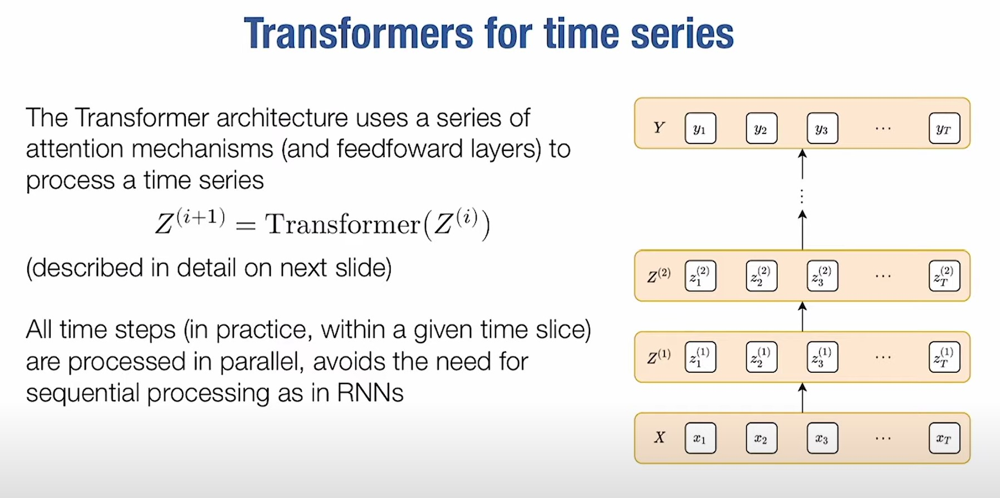

Kiến trúc xếp chồng giống temporal cnn :D

Để duy trì casual property (tính nhân quả), thì cần thay đổi cơ chế self-attn, vì self-attn sẽ trộn mọi tokens đầu vào nghĩa là một tokens đầu ra sẽ bị ảnh hưởng bởi mội tkn đầu vào.

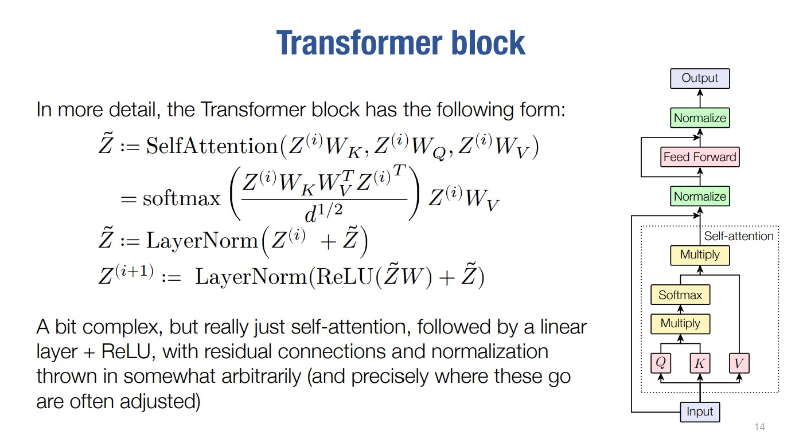

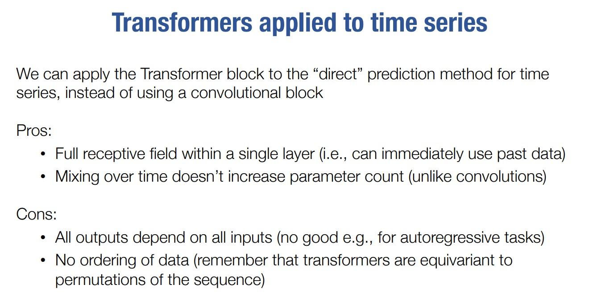

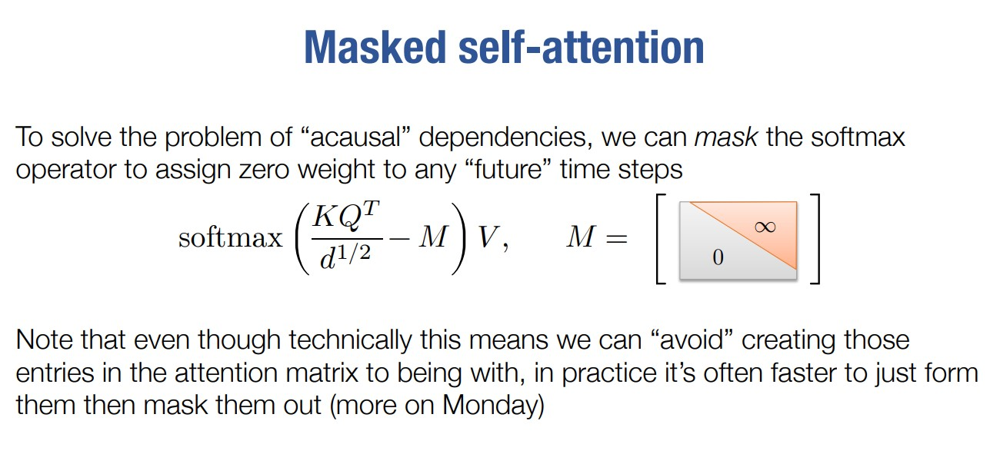

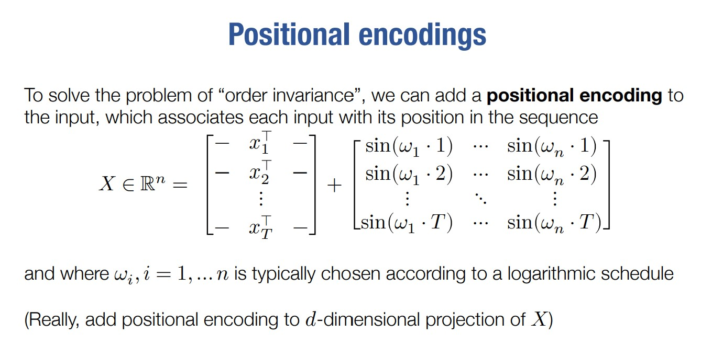


- - -

# "Phillip Isola" on transformer
- video https://www.youtube.com/watch?v=Smav86u60FM
- notes https://phillipi.github.io/6.s898/materials/notes/09_transformers.pdf
- slide https://phillipi.github.io/6.s898/materials/slides/9_transformers.pdf

2 ý tưởng chính về transformers là __Tokens và Self-Attention__. Và thêm vài thứ khác :) 

Trong AI, nơ-ron là số thực, just scalar numbers, và tokens là vectors. Đó là sự khác biệt mà tôi concerned.
Như vậy __token__ chỉ là lingo cho __a vector of neurons__. Mà nơ-ron là scalar number =>
__token__ đơn giản là __vector__: kiểu dữ liệu 1D array of scalar numbers.

- Trong NLP thì token khởi đầu bằng one-hot vectors.
- Trong Vision token là patch, tức là ta duỗi điểm ảnh của một ô đơn vị ảnh từ 2D array ra 1D array

## Tokenizing input data

Bạn có thể biến mọi data của mình thành tokens.


Mục tiêu của việc tokenization là biến data thành dữ liệu dạng chuỗi - a sequence of vectors. Transformer thực sự treat tokens như là một set, nhưng mọi người thường nói về nó như là một chuỗi (đó là lý do transformer cần thêm positional embedding để đánh dấu thứ tự của token trong chuỗi).

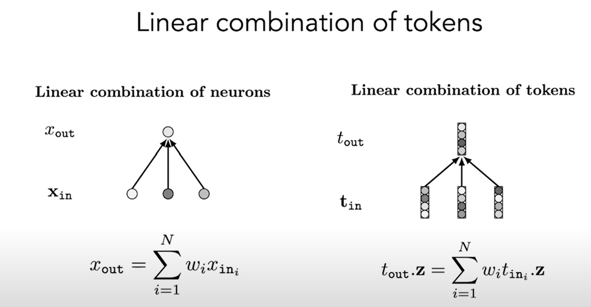

Trong mạng nơ-ron nhân tạo tiêu chuẩn thường có 2 tầng chính là tầng linear combination hay tầng linear, và tầng thứ 2 là pointwise (đầu vào là từng điểm 1 trên input tensor) nonlinearity, có thể là giá trị của hàm sigmoid.


Tương tự như vậy khi deal with tokens, ta có khái niệm token-wise nonlinearity, 
`t_out = [F_theta(t_1.z),..., F_theta(t_N.z)]` với F thường là MLP.
Khái niệm này tương đương với 1 CNN với 1x1 kernels, chạy trên chuỗi tokens đầu vào.

=> Transformer and CNN, it's all the same idea of rehashed.

```
Q: z ở đây là gì?
A: z is the token code vector, meaning the vector of neurons inside that token. 
`token.z` ở đây hàm ý z là thuộc tính con của token, ám chỉ this code token that lives inside it.

Q: analogy to convolution here là gì?
A: conv apply the same operator tới một phần tử của chuỗi. Và minh họa ở trên làm điều tương tự. So it's like slide a (non-linear) filter across the sequence, vì thế có thể nghĩ nó như là 1x1 kernels
```


Ở hình minh họa trên hàm token-wise nonlinear F_theta là biến đổi từng token vector input thành token vector output. Nó giống như cửa sổ trượt của CNN. 

## Token nets


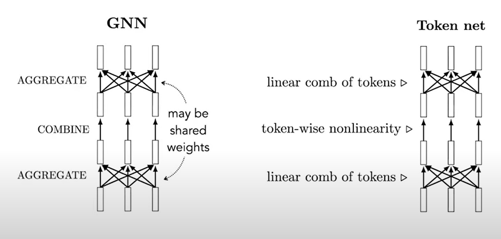

Hóa ra GNN cũng có cùng cấu trúc với Transformer.
__token nets, graph nets, transformers are all the same thing__ 

Bạn có thể coi transformer là một dạng đặc biệt của graph nets, nếu bạn thích nhìn theo cách đó hơn.

## Ý tưởng thứ 2: attention

Như vậy ý tưởng đầu tiên là build things out of token - vector-valued units, thay vì nơ-ron - scalar-valued units. Ý tưởng thứ 2 làm nên tên tuổi cho transformer là attention, có hẳn 1 layer gọi là attention trong transformers.


- trong linear bạn có một weighted combination với W là free parameters và có thể được cập nhật (trong quá trình huấn luyện)
- trong Attn bạn cũng có một weighted combination của inputs để tạo ra output, nhưng các tham số - giá trị của ma trận A không học được (không được cập nhật), thay vào đó nó sẽ phụ thuộc vào dữ liệu (data-dependent), nó sẽ là một hàm của một loại dữ liệu khác.

So when you have data-dependent linear combination where the weights are functions of some other data, then that's called attention. A is a weight matrix that's a function of something else, it tells you how much weight to apply to each token in the input sequence, you'll take a weighted sum, which is just matrix multiply A by the tokens. 


## Intuition of attn https://youtu.be/Smav86u60FM?t=656

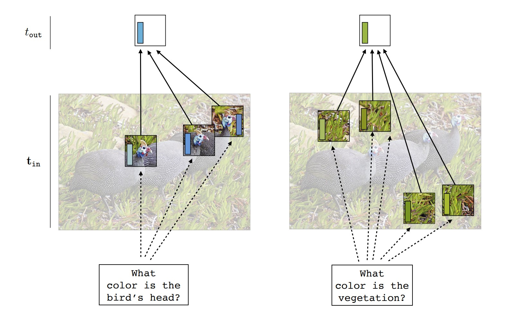

Ta có thể có attn give me by some other branch of my NN. Nó có thể là một nhánh NN để phân tích câu hỏi. Và câu hỏi đó sẽ cho ta biết patches nào của ảnh đầu vào ta nên chú ý đến. Các patches đầu vào được biểu diễn bởi tokens. Và ta có thể nói đây là các patches tôi sẽ cho trọng số cao hơn, và sau đó tôi sẽ tính weight sum of the code vectors inside those patches to produce an output.

Ta có thể đặt câu hỏi "màu sắc của đầu con chim trong hình là gì?", tức là ta sẽ chú ý tới đầu chim. Hoặc "màu sắc của cỏ là gì?" tức là ta sẽ chú ý tới nền cỏ. So it's just saying which tokens or patches there are going to be getting a lot of weight to make my decision. And then we'll report best green because the token code vectors will have represented some information like the color of the token.

## Query-key-value attention https://youtu.be/Smav86u60FM?t=717

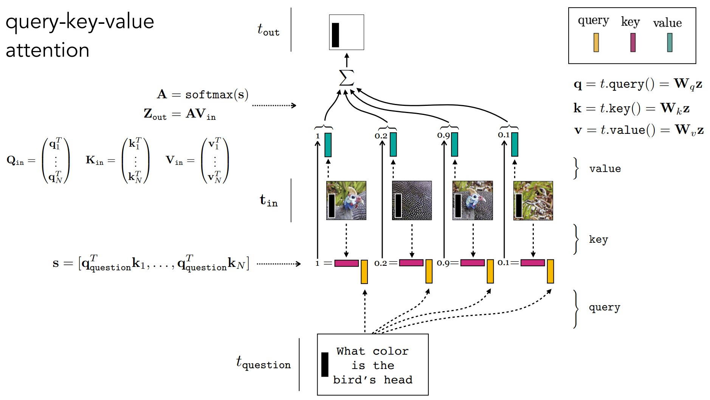

Một attention điển hình sẽ như hình trên, nó cũng làm nổi rõ notation `token.z` để thể hiện vector live in side a token. Ý muốn nói là trong token chứa nhiều loại thông tin:
- `token.z` là giá trị vector của nó
- `token.query() = W_q token.z`
- `token.key()   = W_k token.z`
- `token.value() = W_v token.z`

Ta có thể thấy .query(), .key(), .token() là 3 hàm f_q(t), f_k(t) và f_v(t). Và q, k, v là 3 giá trì đầu ra khi áp dụng 3 hàm đó vào 1 token t nhất định. Ở ví dụ trên W_q, W_k, W_v là 3 ma trận trọng số có thể học được - là triển khai cụ thể của cơ chế attn.

Tổng quát hơn nữa ta thấy với transformers có thể quy mọi thứ về token. t_question cho câu hỏi, t_input cho dữ liệu cần tìm câu trả lời trên nó rồi t_out cho câu trả lời đầu ra (input là t_question và t_in, output là t_out).

Diễn giải bằng lời: this is like attn from the question branch, but i could __just have the data choose what in its own__ token sequence to attent to. Each token chooses which other tokens to attent to, and that's called self-attention.

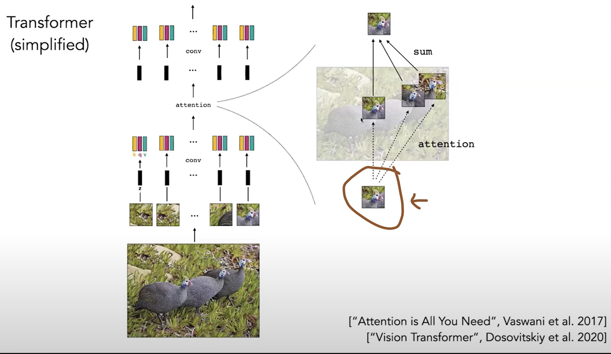
This picture here where this patch sẽ quyết định, cái gì sẽ được chú ý đến để có được một biểu diễn tốt hơn của that patch, essentially.

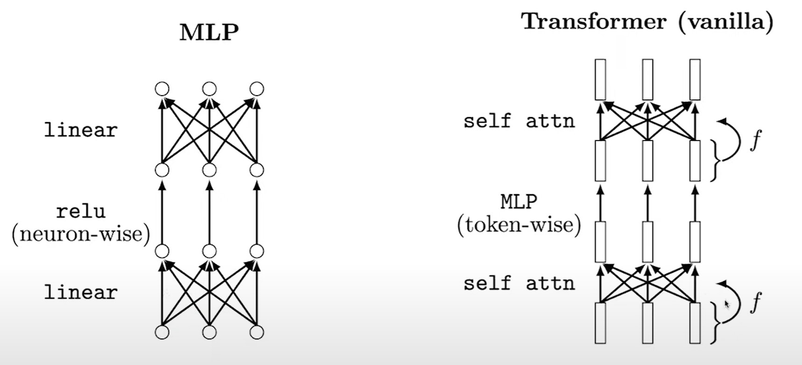
Hàm f ám chỉ sự phụ thuộc của weight vào data. Và vì f không đến từ bên ngoài nên cơ chế này được gọi là self-attention (no external source).

## Demo https://youtu.be/Smav86u60FM?t=945
(xem video để thấy chuyển động của mô hình)

To connect it to one of the most common demonstrations of transformers is to do sequence modeling. Nhưng thực sự transformers are more about set to set operations. Bởi bạn có thể biểu diễn seuquence như là một tập hợp, so it's fine.


Ở ví dụ trên, từ chuỗi đầu vào "colorless green ideas sleep", mô hình dự đoán token tiếp theo là "furiously", và token này lại nối tiếp với chuỗi đầu đang có trở thành chuỗi đầu vào tiếp theo "colorless green ideas sleep furiously" để tiếp tục dự đoán. Và thay vì dự đoán từ tiếp theo, ở các bài toán khác bạn có thể dự đoán protein tiếp theo, hay là sound wave tiếp theo ...

```Q&A
Q: lịch sử của term key, query, value là gì?
A: tôi nghĩ nó đến từ data retriveval database. Bạn có database lưu trữ tri thức trong các cells. Và bạn có thể query database đó. Bạn nói tôi muốn tìm những thứ liên quan tới "drafts". Và mọi cell đều có nhãn gọi là key, ví dụ như đây là cell cho mammal, đây là cell cho giraffes, và đây là cell cho plants. Và bạn match query vào key. Và những thứ có trong cell mà bạn thu về được gọi là value.

Q: giả sử câu hỏi là "đâu là màu sắc của đầu con gà tây", và vì một vài lý do nào đó, đầu gà tây là một đặc trưng đủ phức tạp mà nó không thể được biểu diễn tốt trong một token, điều đó có gây ra vấn đề gì cho việc attending to the right things, or weighting the right thing properly?
A: Một trong những câu trả lời là chúng ta có multi-head attention, nơi mà bạn sẽ lấy sequence của mình hay your set of tokens và bạn sẽ có n query vectors khác nhau, n value vectors khác nhau, và n key vectors khác nhau và mỗi query có thể hỏi một kiểu khác nhau kiểu như: một query sẽ hỏi tôi muốn match the same color, query khác hỏi tôi muốn match the same geometry. Và khi bạn tối ưu các tham số của mạng, bằng một cách nào đó chúng sẽ tự tổ chức, well, if it's useful to factor things into geometry and color, thì sẽ có một attention head take cares about color, and one that cares about geometry.

Q: Tôi có câu hỏi về phi tuyến tính trong transformer. Nếu tôi nhớ không nhầm thì bạn sẽ chuẩn hóa cho mỗi token, intution khi làm việc đó là gì? Tôi không thấy người ta làm việc đó nhiều trước khi transformer xuất hiện.
A: Đó là một câu hỏi tuyệt vời. Thông thường bạn sẽ weighted sum to add up to one, so the weight should add up to one. Và chúng ta làm việc đó thông qua softmax over the weights.

Q: Ồ, tôi muốn hỏi về residual connection cơ.
A: À đó là layernorm. Theo hiểu biết của mình, tôi thấy laynorm, residual connection chỉ là mẹo để giúp network có thể train. It's good to normalize things.
Brian Cheung: Transformers rất khó để train, đặc biệt là một vài tầng, như là tầng thứ 12 trở lên. Nếu bạn không có residual connections hay layernorms.

Q: Làm thế nào để quyết định dùng patch nào? Ví dụ trong ảnh hoặc text you also had what seemed to be arbitrary segmentation of data.
A: Đó là một câu hỏi tuyệt vời. Like how do you do the tokenization? Like how do you design that. I think it's super hacky right now. So that feel like somewhere that people could do a lot of work. One thing does seem to happen is that __the smaller you make your token, if you have token that are a single pixel, it's just better you get__. So maybe what happen is just stop having clever tokenization and just go down to whatever atomic units of the data are, like a single character, a single pixel, and that just makes the choice for us because you can't go below that, really. Vì thế tôi nghĩ (tokens) càng nhỏ hơn trong ViT, thing i've seen is that smaller the tokens are, the better they tend to perform. Bởi vì do cơ chế attn là every tokens attends to every token, nó là n^2, nên nếu bạn chọn tokens quá nhỏ, có quá nhiều tokens bạn sẽ bị run out of memory. Vì thế có những cách tknz thông minh như superpixels, hay segmentation. Hay như trong NLP, có rất nhiều cách tknz như bype-pair-encoding, bạn có thể dùng chúng như là tầng tknz đầu tiên. But yeah, that feels like a hackey area right now to me.

Q: Can you try to usually leverage at least some degree of topology by tokenizing it, that respects spatial coordinates for images, or language order for words. Because there's also smt called position encoding, which give you knowledge about the topology of why this element is in this position, versus this other position, and that tell you a lot about the structure of the image, or at least where this oken is with respect to the overall structure of the image.
A: Yeah, và một thứ nữa có vẻ missing right now is people usually envision transformers which i'm most familiar with, that usually break into non-overlapping tokens. But we know from ConvNets and signal processing that you'll get a ton of aliasing in the filtering operations if you have these huge strides, you're bringing in non-overlaping patches, you really want to have overlapping patches, or blur the signal. So all that signal processing stuff I think has been thrown away, and probably it's a good idea to put it back in there.

someone has tried overlapping patches, and it does help. Everythin i say, as you probably know, there's 10k transformer papers now. So i'm sure everthing that you could imagine has been tried.  
```

## Positional encoding

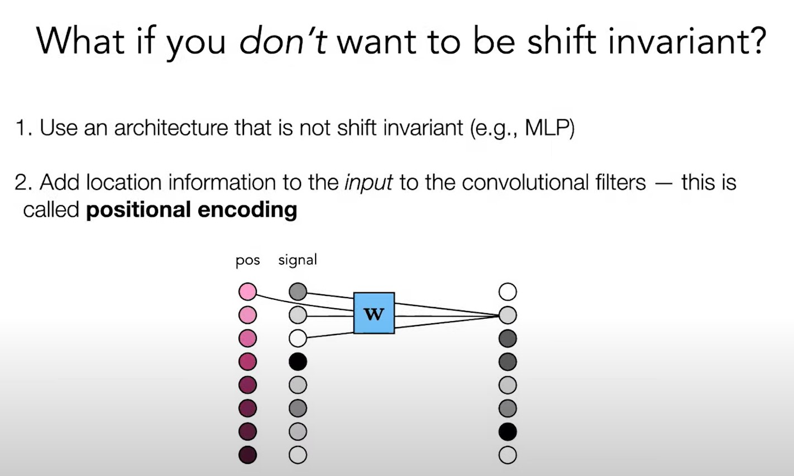

Nếu bạn không muốn bị shift invariant. Một là bạn dùng một kiến trúc không bị shift invariant như MLP. Hai là bạn cho thêm thông tin về vị trí vào input của convolution filters, cách này gọi là positional encoding. Ý tưởng này đã có từ trước.

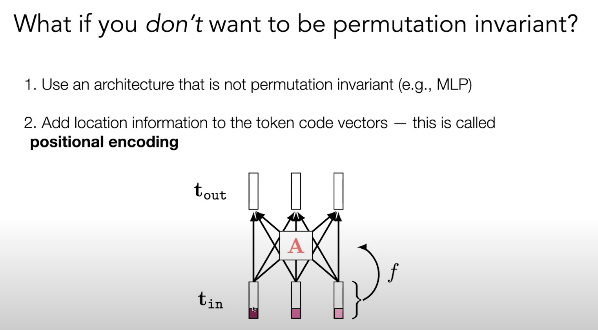

Nếu bạn không muốn to be permutation invariant. Một là bạn sử dụng kiến trúc không bị permutation invariant như MLP. Hai là bạn cho thêm thông tin vị trí vào token code vectors, đó gọi là positional encoding. Và khi làm điều đó bạn được một sequence model. Nếu không làm thế bạn sẽ có property of permuatition equivariance (tương đương hoán vị). This is why I said it's really a set-to-set operation. Vì thế nếu bạn không cho token thông tin nó đến từ đâu, bạn không cho nó positional codes, và khi ta lấy tokens từ input layer, và ta giao hoán chúng theo bất cứ thứ tự nào bạn chỉ đơn giản đang hoán đổi tokens của layer đầu ra. The mapping will be the same up to permutation. Sẽ cần suy nghĩ một chút để thấy điều này là đúng, nhưng lý do cốt lõi là bởi vì attention layer is permutation invariant bởi vì cái cách mà attn hoạt động. Và token-wise (tương đương point-wise) layer is permutation invariant too, so transformer is a permutation invariant function (hàm bất biến hoán vị).

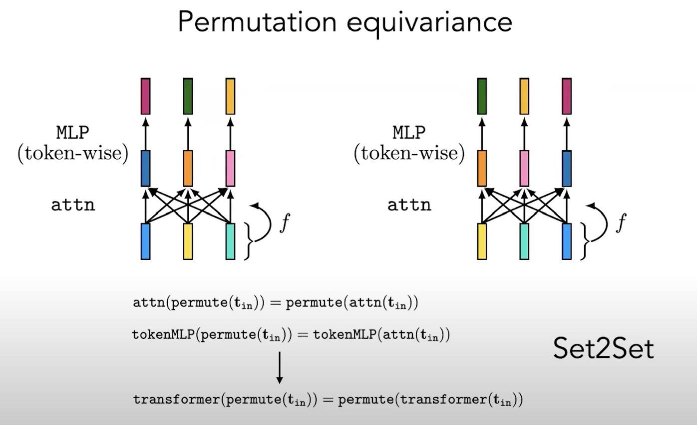

Như vậy nếu có positional encoding, thì nó sẽ là sequence. Còn không transformers sẽ là set to set mapping.

Q: Bạn bắt đầu với ý tưởng về token như một loại cấu trúc dữ liệu mới, but just a few sencences before, you said smt that may sounds like the idea of tokens is rather weakened that the transformers work better when you have individual bits of data, like pixels. Vì thế tôi càm thấy ý tưởng về token không phải là cốt lõi của toàn bộ ý tưởng này, mà attn mới là phần quan trọng nhất. Và ý tưởng có thể attend dynamically anywhere in the picture là ý tưởng gives power in these algorithms, chứ không phải là tokens?
A: Tôi không biết. Và tôi nghĩ rằng that's kind of the open debate. It's fun to keep discussing it. So I think the field is kind of split right now between people thinking that it's the tokens and the vector, encapsulated vectors that are important to this versus the attention, and really if you just have intentional mechanism, you can still be operating over neurons. It doesn't have to be about tokens. Tôi nghĩ rằng cả 2 đều quan trọng để thành công. Một ví dụ phản công là nếu attention matter is there are these other architectures now, sometimes called MLP-mixer, nó sử dụng token chứ không phải attention. Cơ bản MLP-Mixer là ConvNet over tokens, one-by-one conv over tokens, họ gọi nó là MLP-mixer khiến nó trở nên khó hiểu, but anyway MLP-Mixer không có attn. But it's still, in my view, it's a token net, and that seems competitive on some tasks with attention networks. So maybe attention is, maybe it's not.

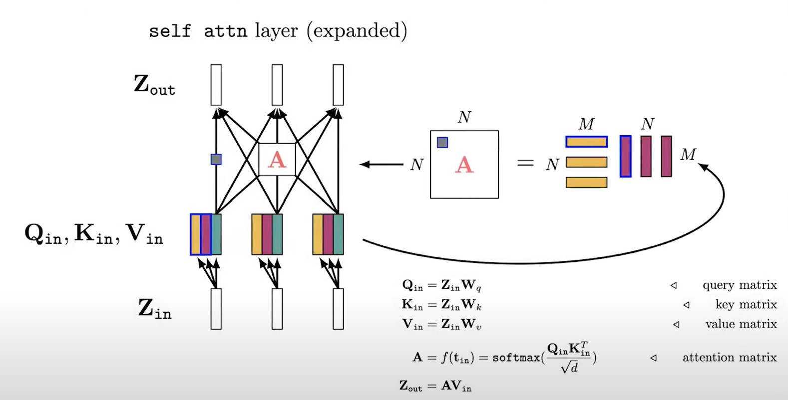
https://youtu.be/Smav86u60FM?t=1664 đoạn này thảo luận về cách nhìn nhận attn dưới góc độ toán học, nó tương đương với phép biến đổi nào ... kiểu đơn giản nó là phép nhân ma trận nên nó sẽ thế này thế kia ...

Q: tại sao không bỏ hết các khái niệm về q, k, v rồi W_q, W_k, W_v đi và chỉ dùng một ma trận để biến đổi vector input thành vector output?
A: Tôi nghĩ sometimes it works just as well. I don't follow latest on that but you can have queries, keys, and values là các hàm tuyến tính of your code vector z, hoặc nó có thể là non-linear functions, hoặc nó có thể là identity. And i'm not sure that there's a consensus (sự nhất trí) on where you need which. Có 1 điều thú vị là nếu bạn dùng identity để tạo ra queries và keys, you're basically creating a grand matrix between all of your token vectors with themselves (hình dưới).

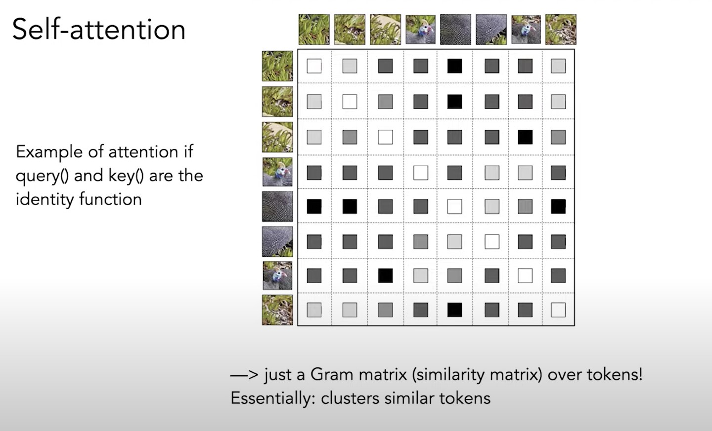

it's going to cluster the data, and there's been some analysis of how identity, attention ... indentity queries and keys will create this cluster, like spectral clustering type matrix. That will create similarity matrix. When you hit the data with that similar matrix, it'll group things that are similar. And maybe you can understand a little bit what going on from that perspective like linear queries and keys are just some projection of that kind of thing.

Q: And how does that work if you don't have the W_q and W_k matrix, but just identity?
A: So ResMLPs are actually like this spectral matrix because what you do is you process the input, transpose it, process it again. If you work out both operations in sequence, they end up becoming Z-transpose, Z with a matrix in the middle. So I think it does work, I guest. ... thảo luận thêm xem nó work and not just well ...

https://youtu.be/Smav86u60FM?t=2113 đoạn này thảo luận về ý tưởng xưa trong CV và cũng có người đã đề xuất dùng pixel + derivate (tức là có thông tin của pixels bên cạnh) để làm inputs và nó chính xác là tokens :D Như vậy ý tưởng về tokens không mới. It's just help me to coalesce around (đoàn kết) in term of tokens. When I think of all operations in terms of tokens, but we used to talk about hypercolumns, and feature vectors, and there's a milion names for the same concepts. 

Rồi, thảo luận thêm về graph network và transformer cái nào tổng quát hơn? Phillip cho rằng GN tổng quát hơn. Và transformer là một GN được kết nối đầy đủ, node nào cũng có thể attn tới node khác ... Và người làm GN thực sự  đã làm attn từ trước. Như vậy ý tưởng attn cũng không hề mới ...

## Brian Cheung: Lesser know facts about transformers https://youtu.be/Smav86u60FM?t=2213


Ta sẽ nói nhiều hơn về quan điểm của cộng đồng ML về attn, và những sự phát triển đang có trong cộng đồng, and go over some kind of unintutive things about transformer that I think are surprising, I guest, to a lot of people now. 

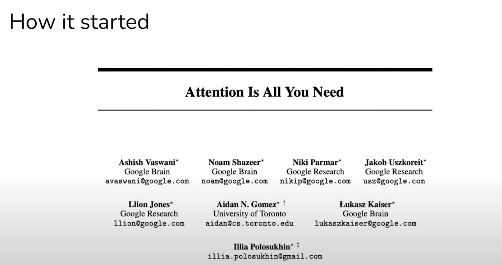

Transformer khởi đầu như là một LM, và họ có một title không thể tuyệt hơn "sự chú ý là tất cả những gì chúng ta cần". Và hóa ra điều đó đang dần trở thành hiện thực hơn mọi người có thể tưởng tượng. Hiện nay transformers đã cover language, speech, vision. Cơ bản nó là một universal model now for all modalities, that people apply to data, actually. Attn không phải là 1 ý tưởng mới.

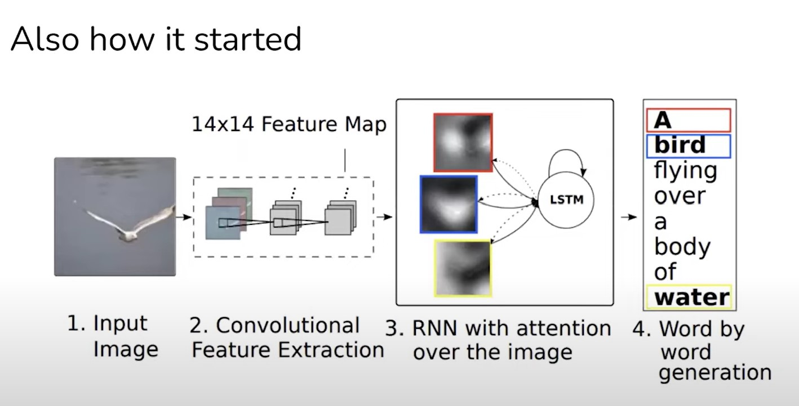

Trước đó đã có nhiều bài báo nói về điều tương tự. Minh họa trên nói về một thứ rất tương tự như vision transformer, attention where they create, essentially, attendable feature maps at the last layer or the next to last layer or the next to last layer of a VGG network that was so spatial. And they able to use it to show that when you do image captioning, it would attend to the correct part of an object. 


Đoạn này nói về sự thành công và tầm quan trọng của Transformer. Tác giả nói rằng khi một mô hình nào đó thành công, là người ta sẽ liên tưởng tới não bộ, liệu não bộ người sẽ làm điều tương tự như thế nào? Có điểm gì chung ở đây không? ...

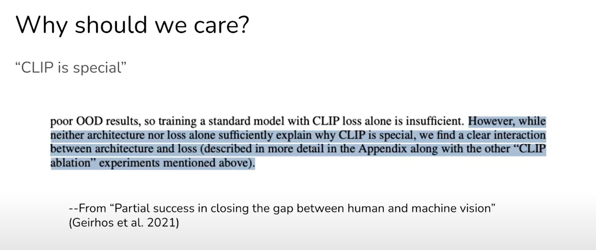

Bài báo nói rằng CLIP (transformer based) lý giải thành công nhất cách con người hoạt động trong vision, tại sao họ lại fail ...
CLIP is an outlier (ngoại lệ) for their comparisons to human behavior.

## Why should we care? https://youtu.be/Smav86u60FM?t=2417

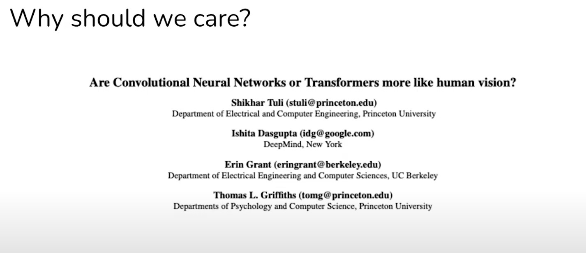


Và Transformer ngày càng đạt kết quả tốt hơn CNN trong CV khiến chúng ta đặt ra câu hỏi, thế giữa CNN và Transformer cái nào gần với human vision hơn?

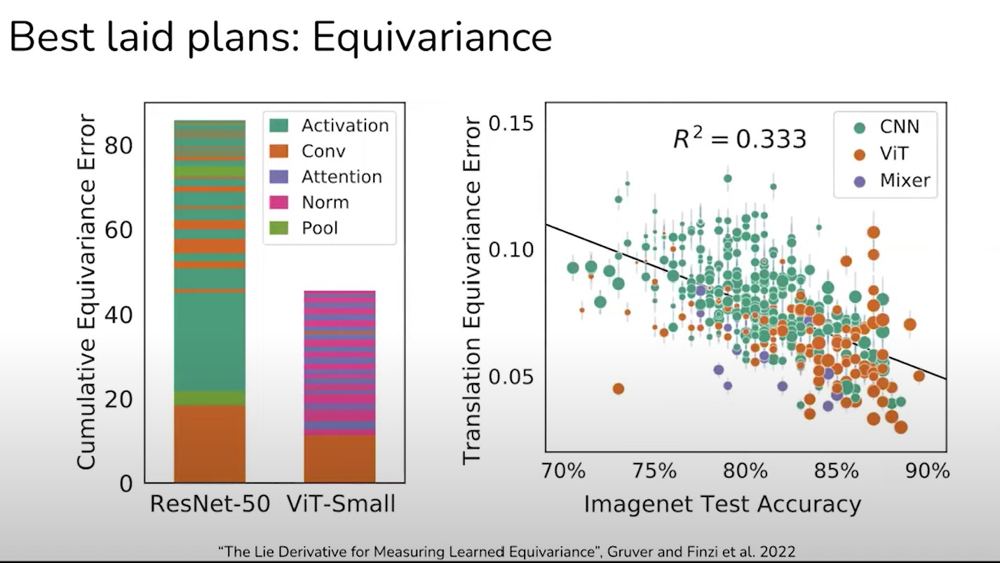

And intutively, you would think that there are certain properties of conv that make conv a conv, and a tfm a tfm. And what makes, what we believe, convolutional convolution is the fact of equiveriance, meaning, as Phil mentioned, when you apply an operation to the input, the operation applied to the output, should be the same type of operation. 

Now the issue is that this turns out not to be exactly true. Turn out __after training, the ViT is more equivariant to translation than a ConVnet__, which i think is quite surprising. So Phil might actually already know the issues with the conv not being equivariant, one thing being that a lot of pooling and other operations even the nonlinearity, contribute to hurting or harming the quivariance performance.

So this plot here is showing this paper's measure, which is rederiative, the equivariance error, of a conVnet, this is ResNet-50 vs a ViT. And it turns out after training, a ViT is translationally more equivariant that a ConVnet which i think is quite non-intutive in the sense that we built in the equivariance, specifically for a ConVnet. Yet, here we are the ViT are more equivariant after training. And some sample on the right show measure of CNN, ViT and MLP-Mixer, Mixer also has surpoisingly high equivariance after training. And equivariance increase after you improve test accuracy.

## Scaling https://youtu.be/Smav86u60FM?t=2656

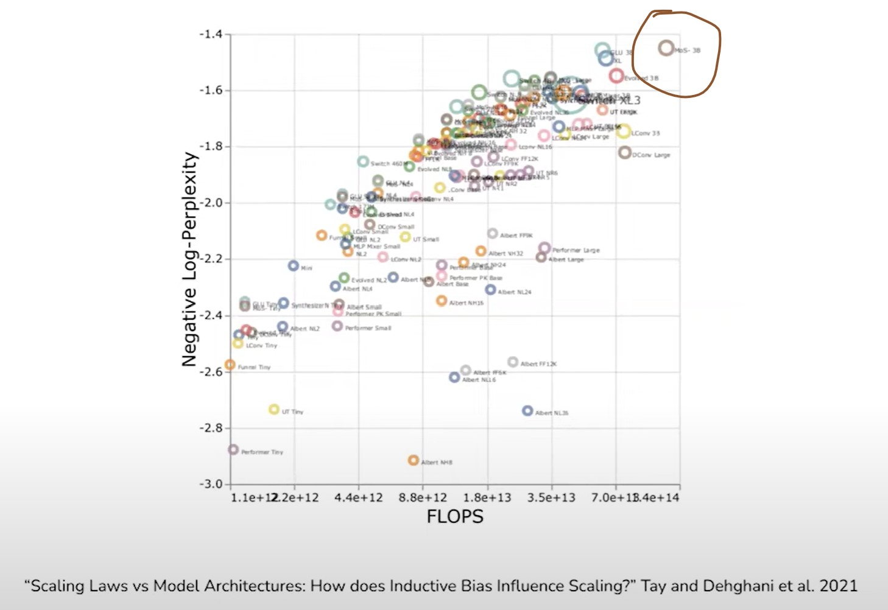
Đoạn này nói về 1 xu hướng trong cộng đồng về scaling ... nên xem để biết chi tiết ...

__Người ta cố gắng triển khai những mô hình có số params nhiều, dùng nhiều data và FLOPs tính toán để thay vì cho inductive bias vào model trước khi huấn luyện thì để mô hình tự học inductive bias từ dữ liệu__

Như vậy trong tương lai sẽ có có ít indutive biases trong cộng đồng học máy because they are willing to pay this cost of compute to not have built-in inductive bias that they would normally have to build in for smaller data sets. 

## https://youtu.be/Smav86u60FM?t=2994

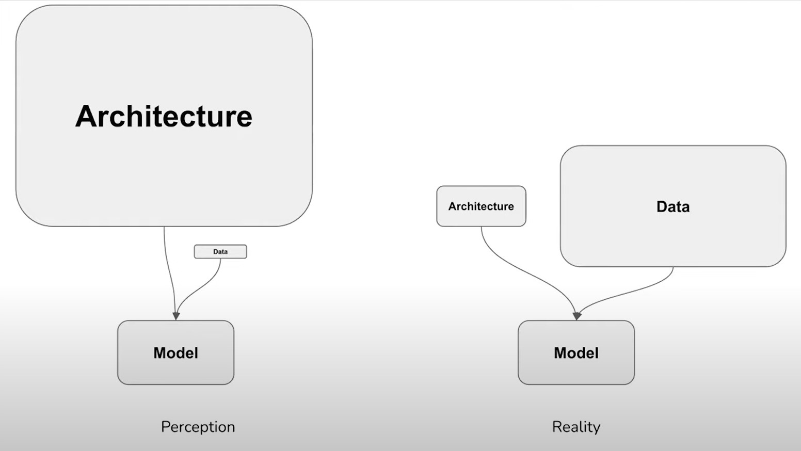

"I think this (picture) tells you a story that maybe the machine learning community is going towards, which is not the fact that architecture matter the most, but the fact that data is actually the really important aspect. And I think they are building now architectures that aren't necessarily good at working well without being trained, but furthermore, work well at aborbing data lot more efficiently than other architectures."

And I think we should think about the things that lead to the resulting model that we work these days, which is the idea that it's not just the model itself, with it's architecture. But there are priors about the compute, the capacity of the model to train over that data, and also, more importantly, now more recently, the nice thing is that, as Phil mentioned, the notion that __a lot of these models don't require supervision__ so they can absorb larger and larger data sets without much economic cost to the person training it.

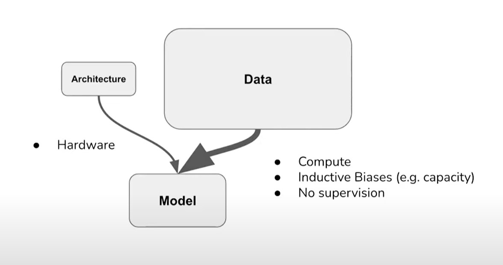

And also one other aspect of transformer is the way it was created was mainly as an alternative to RNN and the reason for that is because you see on the left here, I mentioned HW. And one of the things about transformers is that they're much more parallel-able in GPUs than a RNN and they run much more better on like superly parallel software than a RNN does, and that why they've become very popular also is because the parallelization of them is much easier than other sequence models.

## Discussion

- By introducing the idea of attn dynamically handled by the data, you kind of have i don't, it's an overstatement, but as general architectual as you can have. Like you have really powerful architecture and now to train it you need a lot of data. And this is realy where we are now. and more data  does better just because the architecture is extremely general, much more than conv as you said.
- Phil: They are lacking in one thing, which is __vanilla transformers don't have memory__, they don't have feedback connection, and so they not trained completely in the same way that an RNN is. Of course people adding memory and recurrence to transformers, but still, the majority of them don't have that. So that's actually, I think, a big limitaion. They don't have memory.
The second point is evetually lookup tables will perform best, or nearest neighbor will perform best, because the limit of infinite data does work, and we dont know if these work in the limit of infinite data. I think it less surpising that you need less structure with more data.

__Main point of the discussion__: So the question is, what are we interested in, in terms of if these architectures become less biased to wards being structually more 	relevant to neuroscience, but just being more task-relevant to neuroscience? Are we going to be stuck at some level of understanding that's only functional? ...

Xem tiếp ở đây https://youtu.be/Smav86u60FM?t=3200

Có bài báo nói rằng train GPT2 on 10m of tokens (usually they are trained on billions of tokens) and it explain fMRI as welll as a billion one.

So there may be a shift here between models that are like and you called it out, like hey, we can instead of us having to hand design them in, this is the bitter lesson version, we'll just lean on the data with a general flexible thing and let the data push it as long as our compute can handle that, and we have enough data. And I think the question we're asking that's intersting us, some of us, is does that end state? Which of those end states looks more like the adult end state that's agnostic to whether neither of them probably followd the same biology path, but just even in that assumption state, what is the state of affairs? I don't think we know what is state of affair is for ViT relative to ConvNets, on aligments with even visual processing.

- - -

# Attention and Transformer
- 11785 https://youtu.be/amqFoES3c1w?t=663

## Q, K, V in Attention

Database Analogy
- Q(uery) is query you typed in to get the data
- K(eys) point to where information is
- V(alues) are information itself

=>

- `Query` is what **pays attention**: what looking for where I get information from?
- `Values` are what are **paid attention to**
- `Keys` helps queries figure out **how much attention to pay** to each value

- `Attention Weights` how much attention to pay


The red guy is the current token, it wonders how do i adapt to my context? And all the bule guys are there to help. They said "hey, this is me, here is my information!"

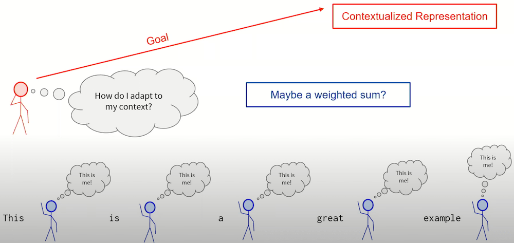
The red guy goal is to get a contextualized representation. And the guy think: "may be I can do a weighted sum? May be I can use all of this information and do a weighted some to get my contextualized representation."


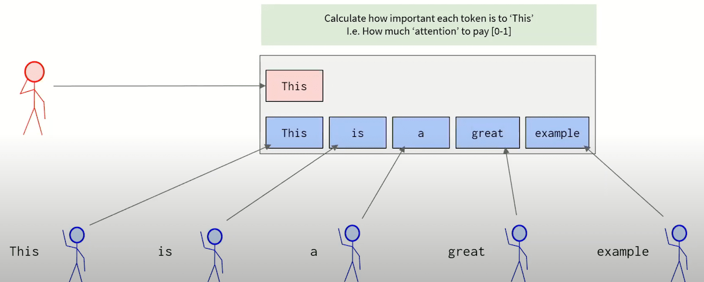
Use enery function $e_ij =  q_i^T k_j$, then softmax to normalize 


`Query` is the guy are wondering "How do I contextualize my own represention?".
`Keys` are all other guys. They said here is my information, try to use it to contextualize your represention!


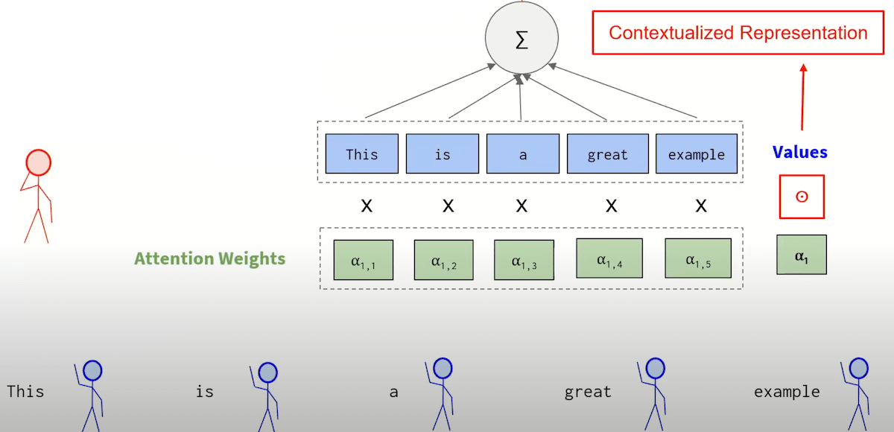
What we use to multiple with attenion weights are called `Values`. The weighted sum to get contextualized representation.


`h` is a vector representation of token, it can be one-hot or anything ...
W_Q, W_K, W_V are just matrix to do linear projection to other dimentions.

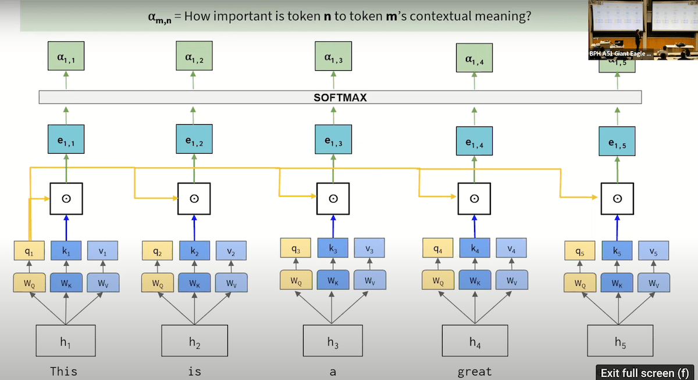
We take one query, one key and calculate energy score or one attention score. And do 
the same for other keys. And get scores for each of (key) tokens. We pass everything to the softmax. And we have `attention weights`.

> `attention weight` $alpha_m,n$ is how important token n to token m's contextual meaning?

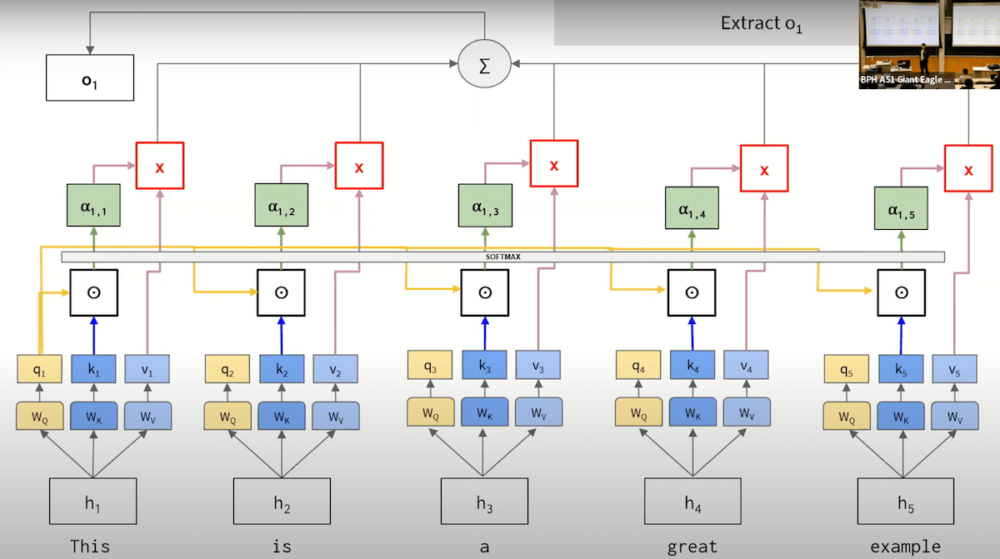
Now we take all of the `values` (h @ W_v), multiple them with each of attention weights that we found, take a weighted some to get the output o (contextualized representation).

## Scaled-dot attention
https://youtu.be/amqFoES3c1w?t=1054

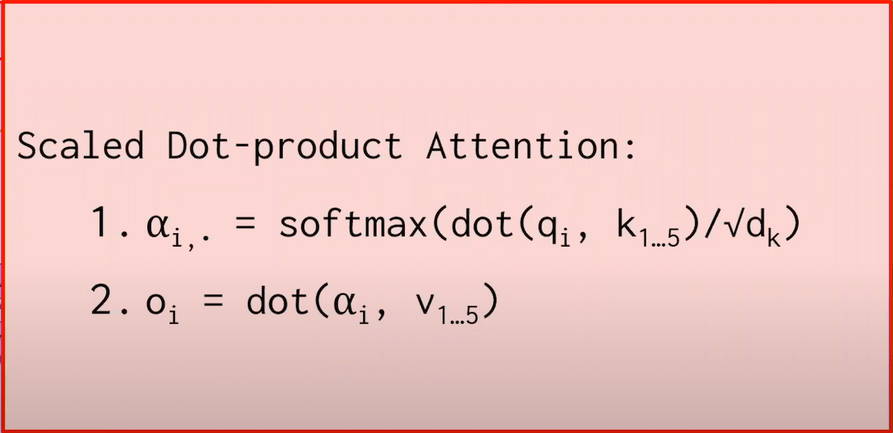

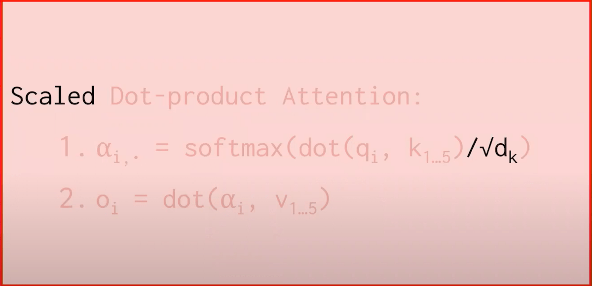
Scaled mean divide by dimensionality of the keys. This is done before we do softmax. 
Why we do it? => To keep values numberically stable (not too extreme ...)


dot product are enery function, the function we use to score each of the key using a query.


3 is dimensionality of the key.

## Self-attention
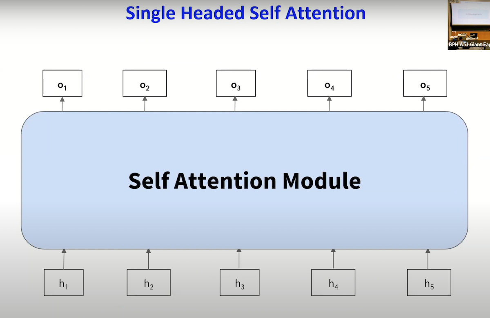


## Attention is all we need

